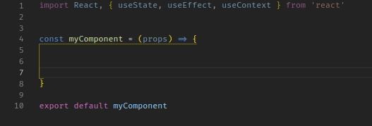
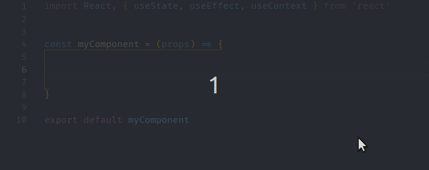
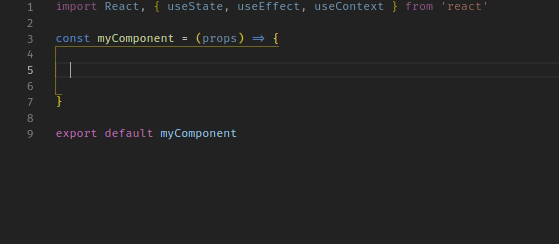
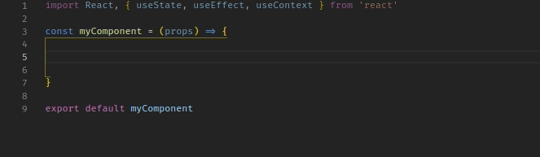

	

----

	
	
	

	
	
	

----

React Hooks Snippets is a [Visual Studio Code](https://code.visualstudio.com/) extension to make writing ReactJS [Hooks](https://reactjs.org/docs/hooks-intro.html) easier and faster!

## Features
Currently, three hooks are supported: `useState`, `useEffect`, and `useContext`.

### useState
Type `ush` to `u`se `s`tate `h`ook!

### useEffect
Type `ueh` to `u`se `e`ffect `h`ook!

### useContext
Type `uch` to `u`se `c`ontext `h`ook!

### useCallback
Type `ucbh` to `u`se `c`all `b`ack `h`ook!

### useMemo
Type `umh` to `u`se `m`emo `h`ook!

## Add to your project

There are 2 ways you can add React Hooks Snippets to your project:

### By command
Launch VS Code Quick Open (Ctrl+P), paste the `ext install AlDuncanson.react-hooks-snippets`, and press enter.

### By the Extension Marketplace
Launch VS Code Extension Marketplace (Ctrl+Shift+X), search for `React Hooks Snippets`, and look for my logo!

## Todo
- [ ] add `useReducer` hook
- [X] add `useCallback` hook
- [X] add `useMemo` hook
- [ ] add `useRef` hook
- [ ] add `useImperativeHandle` hook
- [ ] add `useLayoutEffect` hook
- [ ] add `useDebugValue` hook

Pull requests are more than welcomed!

## License
Usage is provided under the [MIT License](http://http//opensource.org/licenses/mit-license.php). See LICENSE.txt for the full details.